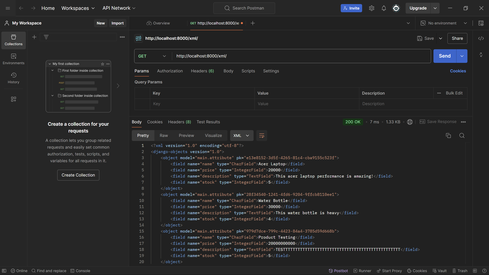
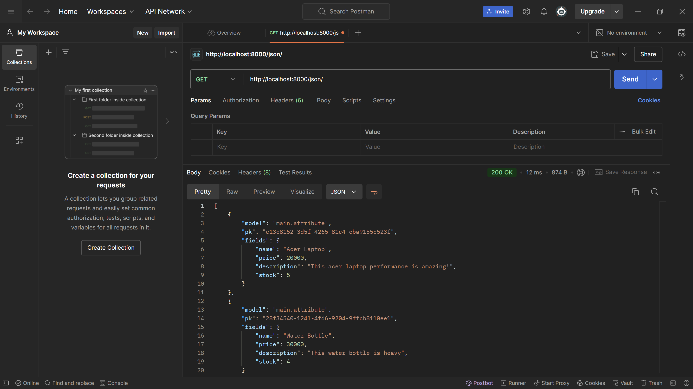
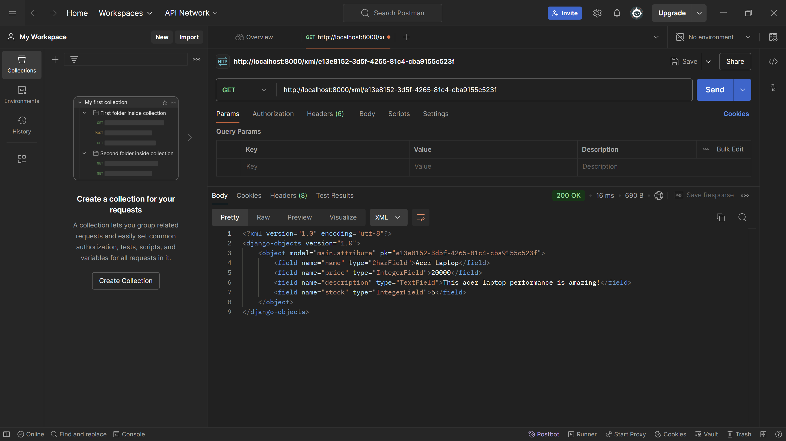
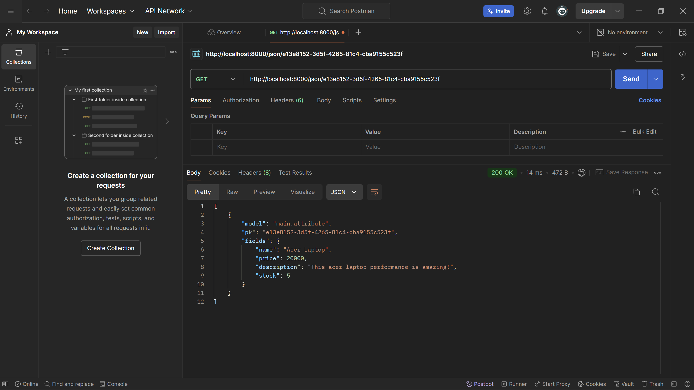

## PWS LINK

- PWS Deployment Website : [checkoutify](http://raffi-dary-checkoutify.pbp.cs.ui.ac.id/).

## Tugas 2

1.  - [x] Membuat sebuah proyek Django baru.
      - Membuat direktori untuk menyimpan proyek Django, di kasus ini saya membuat direktori checkout-ify.
      - Buat virtual environment baru di direktori tersebut lalu aktifkan virtual environment tsb.
      - Gunakan requirements.txt untuk menyimpan dependencies yang akan di install di proyek lalu jalankan install terhadap txt file tsb.
      - Konfigurasi proyek dan coba jalankan server.
    - [x] Membuat aplikasi dengan nama main pada proyek tersebut.
      - Aktifkan environment lalu buat aplikasi main dengan menjalankan command, masukkan main kedalam installed apps.
      - Buat direktori templates untuk menyimpan file html sebagai tampilan dan struktur dasar dari web app.
    - [x] Melakukan routing pada proyek agar dapat menjalankan aplikasi main.
      - Dengan menambahkan kode di urls.py di tingkat proyek kita dapat menghubungkan main dengan proyek utama kita.
    - [x] Membuat model pada aplikasi main dengan nama Product dan memiliki atribut wajib sebagai berikut.
      - name dengan models.CharField(max_length=255) untuk menyimpan data string dengan panjang maksimal 255.
      - price dengan models.IntegerField() untuk menyimpan data Integer.
      - description models.TextField() untuk menyimpan data string yang panjang.
      - stock models.IntegerField() untuk menyimpan data Integer.
    - [x] Membuat sebuah fungsi pada views.py untuk dikembalikan ke dalam sebuah template HTML yang menampilkan nama aplikasi serta nama dan kelas kamu.
      - Import render kedalam views.py untuk merender html dengan fungsi views.py yang kita definisikan.
      - Buat fungsi show_main yang berisikan nama aplikasi, nama, dan kelas yang nanti akan dihubungkan dengan file html.
    - [x] Membuat sebuah routing pada urls.py aplikasi main untuk memetakan fungsi yang telah dibuat pada views.py.
      - Untuk routing, buat urls.py di direktori main yang menyimpan path yang berisikan fungsi dari views.py yang ingin dihubungkan dengan tampilan main.
    - [x] Melakukan deployment ke PWS terhadap aplikasi yang sudah dibuat sehingga nantinya dapat diakses oleh teman-temanmu melalui Internet.
      - Buat proyek baru di PWS dan sambungkan dengan direktori proyek dengan menggunakan remote add.
      - Push proyek lokal ke PWS agar bisa dijalankan di PWS.

2.  Client -> urls.py -> views.py -> models.py -> HTML PAGE

    - Request: Client mengirimkan permintaan HTTP/HTTP Request ke aplikasi Django.
    - Django pertama-tama memeriksa urls.py untuk menemukan view mana yang seharusnya menangani permintaan tersebut.
    - Setelah urls.py memetakan URL ke view yang sesuai, fungsi view ini dipanggil. View ini biasanya mengolah data dari models.py.
    - Ketika view membutuhkan data dari database, view akan berinteraksi dengan model dan mengambil data yang dibutuhkan.
    - Response : Setelah data diolah di views.py, data tersebut dikirim ke template untuk dirender menjadi halaman HTML yang dikirim ke klien sebagai respons.

3.  Git adalah alat manajemen versi (version control system) yang sangat penting dalam pengembangan perangkat lunak, dengan git kita dapat menyimpan semua perubahan yang terjadi terhadap proyek kita dan melakukan rollback apabila ingin kembali ke versi lama dari program teresbut, dengan git kita juga dapat mengerjakan proyek secara kolaboratif dengan mudah.

4.  Django adalah framework yang sangat cocok untuk pemula karena memberikan keseimbangan antara kemudahan penggunaan dan kekuatan fungsional. dokumentasi yang banyak, keamanan , dan skalabilitas yang baik menjadikan Django sebagai framework yang bagus untuk memulai pembelajaran pengembangan perangkat lunak, khususnya di bidang pengembangan web.

5.  Model pada Django disebut sebagai ORM (Object-Relational Mapping) karena Django menggunakan model sebagai cara untuk menghubungkan kode Python dengan tabel-tabel dalam database relasional.

## Tugas 3

1. Data delivery digunakan untuk pengiriman data dari suatu komponen ke komponen lain dalam sebuah platform. Dengan adanya data delivery yang efisien dan andal, berbagai komponen dalam platform dapat berkomunikasi secara lancar, dan informasi yang dibutuhkan selalu tersedia tepat waktu dan dalam kondisi yang benar.

2. Menurut saya, JSON lebih baik daripada XML karena readabilitynya yang lebih mudah dibaca dan penggunaan object dalam JSON yang saya sudah lebih familiar dalam penggunaanya. Secara umum JSON lebih populer dibandingkan XML karena JSON dirancang untuk bekerja dengan JavaScript

3. Method isvalid() digunakan untuk memberikan validasi input kepada form sesuai dengan data model yang telah kita buat, metode is_valid() akan memeriksa tipe data yang dimasukkan pengguna. Jika ada field yang mengharuskan tipe data tertentu, seperti integer, maka is_valid() akan memvalidasi bahwa input tersebut sesuai dengan tipe data yang ditentukan. Jika tidak, form tidak akan dianggap valid, dan submisi tidak akan terjadi.

4. csrf_token digunakan untuk melindungi sebuah proyek django dari serangan csrf atau cross site request forgery, serangan ini dapat dicegah dengen menggunakan csrf_token adalah sebuah nilai acak yang dihasilkan oleh server dan akan ada dalam setiap form yang diisi oleh pengguna. Ketika form dikirimkan, server akan memeriksa apakah csrf_token yang diterima sesuai dengan yang diharapkan, jika tidak server akan menolak request tsb.

5.  - [x] Membuat input form untuk menambahkan objek model pada app sebelumnya.
        - Membuat berkas forms.py di dalam direktori main yang digunakan untuk menambahkan objek model melalui form yang akan menghasilkan fields sesuai dengan model yang telah dibuat

    - [x] Tambahkan 4 fungsi views baru untuk melihat objek yang sudah ditambahkan dalam format XML, JSON, XML by ID, dan JSON by ID.
        - Terdapat 4 fungsi view yang ditambahkan kedalam views.py yang masing2 digunakan untuk menampilkan data yang sudah ditambahkan ke model Attribute
            - show_xml
            - show_json
            - show_xml_by_id
            - show_json_by_id
        
    View ini mengambil semua objek Attribute dari database dan mengubahnya menjadi format xml, json, xml dengan id spesifik, dan json dengan id spesifik, kemudian mengirimkannya sebagai HTTP response.

    - [x] Membuat routing URL untuk masing-masing views yang telah ditambahkan pada poin 2.
        - Untuk mengakses views yang telah dibuat di projek django, kita harus menambahkan rute (URL patterns) di dalam urls.py. Dimana setiap rute mengarahkan ke view tertentu dan diberikan nama untuk mempermudah pemanggilan di kode lainnya

Screenshots
- XML Data Postman

- JSON Data Postman

- XML Data with ID Postman

- JSON Data with ID Postman

